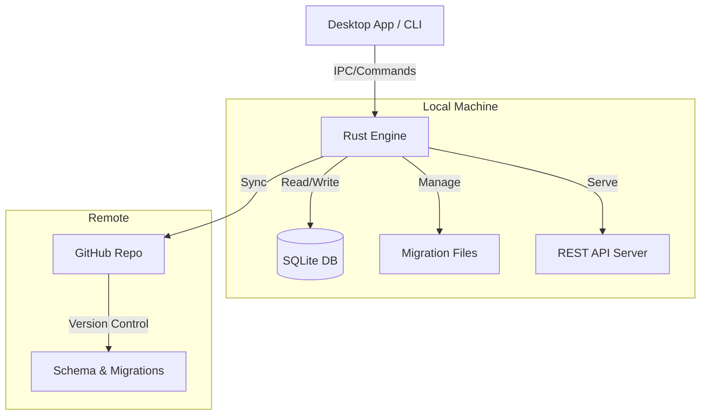

# 🗄️ AirDB

**The local-first, GitHub-backed database platform for schema management and API generation.**

[](https://github.com/Codeenk/airdb/actions/workflows/ci.yml)
[](https://github.com/Codeenk/airdb/releases/latest)
[](LICENSE)
[](https://github.com/Codeenk/airdb/releases)

---

## ⚡ What is AirDB?

AirDB combines the simplicity of SQLite with the power of Git version control. It gives you **full ownership** of your data while enabling team collaboration without the complexity of cloud management.

- 🔒 **Local-First**: SQLite on your machine, zero latency, offline-capable
- 📂 **Git-Backed**: Your schema lives in your repo, versioned like code
- 🔄 **Safe Migrations**: Every change generates reversible SQL migrations
- 👥 **Team Sync**: Branch isolation, merge conflict resolution, and RBAC
- 🚀 **Instant API**: Auto-generated REST API with Swagger UI

---

## 🚀 New in v0.2.6

This release introduces major productivity features:

### 🎨 Visual SQL Editor
Edit tables, columns, indexes, and constraints visually. **Impossible to break production**—every visual change generates a safe, reversible migration file.

### 🔄 Integrated Updater
Built-in update management with safe rollbacks.
- `airdb update check` - Check GitHub releases
- `airdb update apply` - Atomic updates
- `airdb update rollback` - Instant revert to previous version

### 🚀 Auto-Start on Boot
Enable auto-start in Settings → General → "Start AirDB on system boot"

---

## 📥 Installation

### Linux / macOS

```bash
# Download and extract
curl -L https://github.com/Codeenk/airdb/releases/latest/download/airdb-0.2.6-linux-x64.tar.gz | tar -xz
cd airdb-*-linux-x64

# Install (user mode) or use sudo for system-wide
./install.sh

# Verify
airdb --version
```

### Windows

1. Download [`airdb-0.2.6-windows-x64.zip`](https://github.com/Codeenk/airdb/releases/latest/download/airdb-0.2.6-windows-x64.zip)
2. Extract to a folder (e.g., `C:\Program Files\AirDB`)
3. Add the `bin\` folder to your system PATH
4. Run `airdb --version` to verify

See [Installation Guide](docs/installation.md) for detailed instructions.


---

## 🏃 Quick Start

### 1. Initialize a Project

```bash
# Create a new project
airdb init my-project
cd my-project

# Login to GitHub (for sync)
airdb auth login
```

### 2. Create Your First Table

```bash
# Generate a migration
airdb migrate create add_users

# Edit the migration file: sql/migrations/001_add_users.sql
# OR use the Visual Editor in the desktop app
```

### 3. Apply & Sync

```bash
# Apply migrations locally
airdb migrate push

# Sync schema to GitHub
airdb sync setup --create
airdb sync push -m "Initial schema"
```

### 4. Serve API

```bash
# Start the REST API server
airdb serve
# API: http://localhost:54321
# Docs: http://localhost:54321/swagger-ui
```

---

## 📚 Documentation

| Category | Guide | Description |
|----------|-------|-------------|
| **Getting Started** | [**Introduction**](docs/introduction.md) | high-level overview |
| | [**Quick Start**](docs/quickstart.md) | 5-minute tutorial |
| | [**Installation**](docs/installation.md) | Platform setup guides |
| **Core Concepts** | [**SQL Guide**](docs/sql-guide.md) | Working with tables & relations |
| | [**NoSQL Guide**](docs/nosql-guide.md) | Document storage & JSON |
| | [**Migrations**](docs/migrations.md) | Schema versioning explained |
| **Operations** | [**CLI Reference**](docs/cli-reference.md) | Complete command list |
| | [**Updates & Rollback**](docs/updates-and-rollback.md) | Managing AirDB versions |
| | [**Security**](docs/security.md) | Auth, keys & best practices |
| **Collaboration** | [**Team Workflows**](docs/team-workflows.md) | Branching & merging |
| | [**Conflict Resolution**](docs/conflict-resolution.md) | Handling sync conflicts |
| **Support** | [**FAQ**](docs/faq.md) | Common questions |

---

## 🏗️ Architecture



---

## 🛠️ CLI Cheatsheet

| Command | Description |
|---------|-------------|
| `airdb init <name>` | Create new project |
| `airdb status` | Show project status |
| `airdb migrate create <name>` | Create new migration |
| `airdb migrate push` | Apply pending migrations |
| `airdb sync push` | Sync changes to GitHub |
| `airdb sync pull` | Get changes from team |
| `airdb serve` | Start REST API server |
| `airdb update check` | Check for updates |

---

## 📝 License

This project is licensed under the MIT License - see the [LICENSE](LICENSE) file for details.

---

<p align="center">
  <strong>Made with ❤️ by the AirLabs Team</strong><br>
  <a href="https://github.com/Codeenk/airdb/issues">Report Bug</a> •
  <a href="https://github.com/Codeenk/airdb/discussions">Request Feature</a>
</p>
